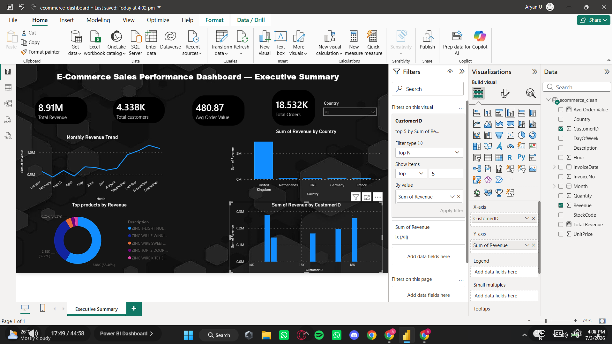

# E-Commerce Sales Performance Analysis

## Overview
Analysed 541,909 transactions from a UK-based online retailer to identify 
revenue trends, top products, key markets, and customer behaviour patterns.

## Dataset
UK E-Commerce Retail Dataset — available on [Kaggle](https://www.kaggle.com/datasets/carrie1/ecommerce-data).
Cleaning steps are documented in `eda_analysis.ipynb`.

## Tools Used
- **Python** (Pandas, NumPy, Matplotlib, Seaborn) — data cleaning and EDA
- **SQL** — business queries and window function analysis
- **Power BI** — interactive dashboard

## Key Findings
-  Revenue trends show strong seasonal growth toward Q4
- UK dominates revenue; Netherlands, Ireland, Germany, and France are the next largest markets
-  A small group of top customers contribute a disproportionate share of lifetime revenue
-  Cancellation rate sits around 2-3% of total orders

## Dashboard Preview

## Repository Structure
- `eda_analysis.ipynb` — Python data cleaning, EDA, and chart generation
- `analysis_queries.sql` — 10 SQL business queries (aggregation, window functions, CTEs)
- `ecommerce_dashboard.pbix` — Power BI interactive dashboard
- `charts/` — exported chart images from Python EDA
- `dashboard.png` — dashboard screenshot

## How to Run
1. Clone the repo
2. Download the dataset from Kaggle (link above)
3. Open `eda_analysis.ipynb` in Jupyter or Kaggle and run all cells
